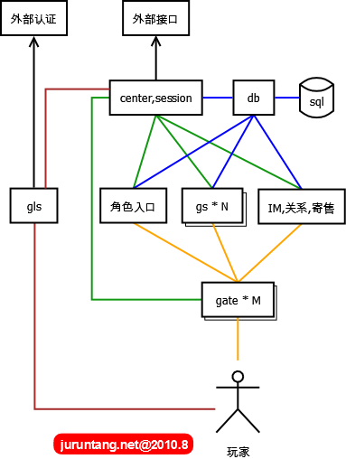

vrGalaxy
========

虚拟银河

下图中每个方框表示一个独立的进程APP组件，每个服务进程如果发生宕机会影响部分用户，整体服务但不会全部中断。在宕机进程重启后，又可以并入整体，全部服务得以继续。

gls
===
game login server，游戏登录服务器，某种程序上，其不是核心组件，gls调用外部的接口，进行基本的用户名密码认证。此外需要实现很多附属的功能：登录排队（对开服非常有帮助），GM超级登录通道（GM可以不排队进入游戏），封测期间激活用户控制，限制用户登录，控制客户端版本等。

db
==
实质上是后台sql的大内存缓冲，隔离了数据库操作，比较内存中的数据，只把改变的数据定时批量写入sql。系统的算法，开发稳定性都要求非常高。

center
======
所有组件都要在这里注册，在线玩家的session状态都在这里集中存放，和各组件有心跳连接。所有对外的接口也全部通过这里。

角色入口
======
玩家登录游戏后的选择角色

gs
====
game server，最核心组件，同一地图，所有游戏逻辑相关的功能，都在这里完成。

gate
====
建立和用户的常链接，主要作sockt转发，屏蔽恶意包，对gs进行保护。协议加密解密功能，一个gate共享多个gs，降低跳转地图连接不上的风险。

IM，关系，寄售
===========
表示其它组件，负责对应的跨地图发生全局的游戏逻辑。